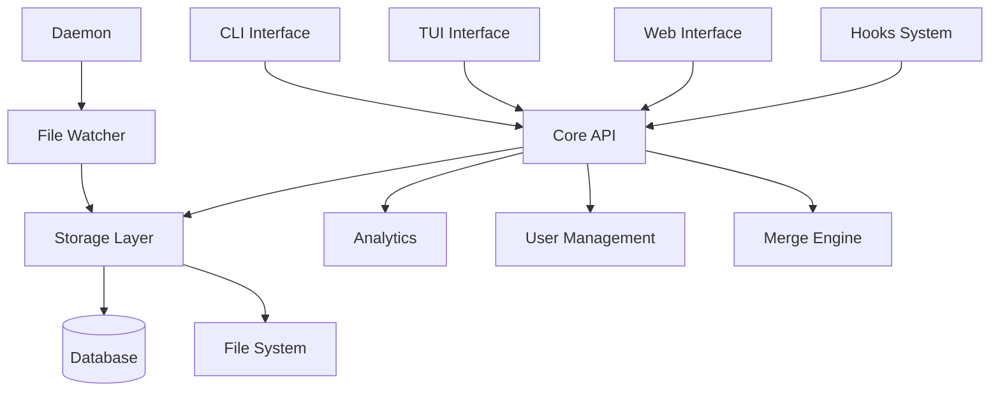
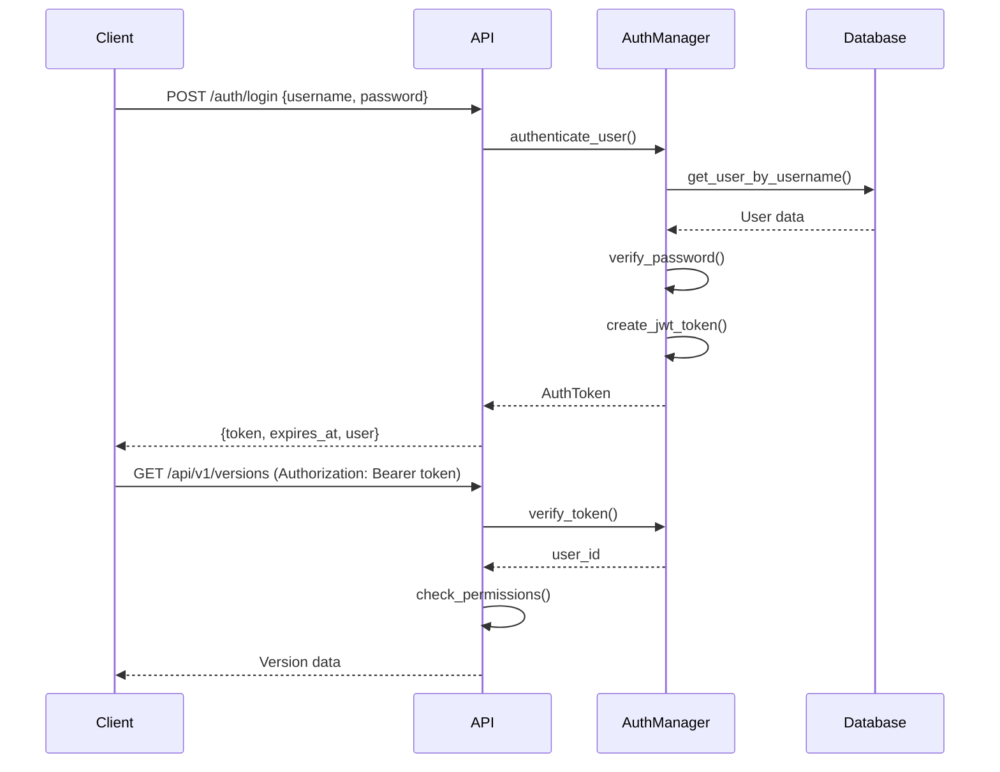

# ChronoLog Architecture Documentation

Comprehensive architecture documentation covering design decisions, system components, and implementation details.

## Table of Contents

1. [System Overview](#system-overview)
2. [Core Architecture](#core-architecture)
3. [Component Design](#component-design)
4. [Data Models](#data-models)
5. [API Architecture](#api-architecture)
6. [Security Architecture](#security-architecture)
7. [Performance Design](#performance-design)
8. [Extensibility](#extensibility)

## System Overview

### Design Philosophy

ChronoLog is built on several key architectural principles:

- **Local-First**: All data is stored locally with optional synchronization
- **Content-Addressable**: Efficient storage using cryptographic hashes
- **Modular Design**: Clear separation of concerns across components
- **API-First**: All functionality accessible via well-defined APIs
- **Extensible**: Plugin system via hooks and modular architecture
- **Performance-Oriented**: Optimized for large repositories and high throughput
- **Security-Focused**: Authentication, authorization, and data integrity built-in

### High-Level Architecture

```
┌─────────────────────────────────────────────────────────────────┐
│                        ChronoLog System                         │
├─────────────────────────────────────────────────────────────────┤
│  CLI Interface  │  TUI Interface  │  Web Interface  │  API       │
├─────────────────┼─────────────────┼─────────────────┼─────────────┤
│                          Core API Layer                         │
├─────────────────────────────────────────────────────────────────┤
│  Analytics  │  Optimization  │  Users  │  Merge  │  Hooks      │
├─────────────┼───────────────┼─────────┼─────────┼──────────────┤
│                      Storage Layer                              │
├─────────────────────────────────────────────────────────────────┤
│  Database   │  File Storage  │  Index  │  Cache  │  Daemon     │
└─────────────────────────────────────────────────────────────────┘
```

### Technology Stack

#### Core Technologies
- **Language**: Python 3.9+
- **Database**: SQLite with WAL mode
- **Storage**: Content-addressable file system
- **CLI Framework**: Click
- **Web Framework**: Flask
- **GraphQL**: Graphene
- **Authentication**: JWT + bcrypt

#### Optional Components
- **TUI Framework**: Textual
- **Monitoring**: File system watching via watchdog
- **Compression**: gzip, lzma, bz2
- **Visualization**: matplotlib, plotly
- **Testing**: unittest, coverage

## Core Architecture

### Layered Architecture

```
Application Layer
├── CLI Commands (chronolog.main)
├── TUI Interface (chronolog-tui)
├── Web Interface (chronolog.web)
└── REST/GraphQL APIs

Business Logic Layer
├── Analytics Engine (chronolog.analytics)
├── Storage Optimizer (chronolog.optimization)
├── User Manager (chronolog.users)
├── Merge Engine (chronolog.merge)
└── Hooks System (chronolog.hooks)

Data Access Layer
├── Repository API (chronolog.api)
├── Storage Manager (chronolog.storage)
├── Database Manager (chronolog.database)
└── File System Monitor (chronolog.watcher)

Infrastructure Layer
├── Daemon Process (chronolog.daemon)
├── Configuration Manager
├── Logging System
└── Error Handling
```

### Component Interaction



## Component Design

### Core API (chronolog.api)

The central API component that provides a unified interface to all ChronoLog functionality:

```python
class ChronologRepo:
    """Main repository interface"""
    
    def __init__(self, repo_path: Path):
        self.repo_path = repo_path
        self.storage = ChronoLogStorage(repo_path)
        self.database = DatabaseManager(repo_path)
        self.daemon = DaemonManager(repo_path)
    
    # Core version control methods
    def log(self, file_path: str = None, limit: int = 50) -> List[VersionEntry]
    def show(self, version_hash: str) -> bytes
    def diff(self, hash1: str, hash2: str = None, current: bool = False) -> str
    def checkout(self, version_hash: str, file_path: str) -> bool
```

### Storage Layer (chronolog.storage)

Implements content-addressable storage with efficient deduplication:

```python
class ChronoLogStorage:
    """Content-addressable storage system"""
    
    def __init__(self, repo_path: Path):
        self.repo_path = repo_path
        self.storage_path = repo_path / ".chronolog" / "storage"
        self.database = DatabaseManager(repo_path)
    
    def store_content(self, content: bytes) -> str:
        """Store content and return hash"""
        hash_value = self._calculate_hash(content)
        storage_path = self._get_storage_path(hash_value)
        
        if not storage_path.exists():
            self._write_compressed_content(storage_path, content)
            
        return hash_value
    
    def retrieve_content(self, hash_value: str) -> bytes:
        """Retrieve content by hash"""
        storage_path = self._get_storage_path(hash_value)
        return self._read_compressed_content(storage_path)
```

#### Storage Structure

```
.chronolog/
├── storage/
│   ├── ab/
│   │   └── cd1234...  # Content files (first 2 chars as directory)
│   ├── temp/          # Temporary files
│   └── index/         # Storage indexes
├── database.db        # SQLite database
├── config.json        # Configuration
└── logs/              # Log files
```

### Database Schema (chronolog.database)

SQLite database with optimized schema for version control operations:

```sql
-- Core version tracking
CREATE TABLE versions (
    id INTEGER PRIMARY KEY AUTOINCREMENT,
    hash TEXT UNIQUE NOT NULL,
    file_path TEXT NOT NULL,
    content_hash TEXT NOT NULL,
    timestamp DATETIME DEFAULT CURRENT_TIMESTAMP,
    size_bytes INTEGER NOT NULL,
    message TEXT,
    author TEXT,
    parent_hash TEXT,
    INDEX idx_versions_hash (hash),
    INDEX idx_versions_file_path (file_path),
    INDEX idx_versions_timestamp (timestamp)
);

-- File metadata
CREATE TABLE files (
    id INTEGER PRIMARY KEY AUTOINCREMENT,
    path TEXT UNIQUE NOT NULL,
    current_version_hash TEXT,
    created_at DATETIME DEFAULT CURRENT_TIMESTAMP,
    updated_at DATETIME DEFAULT CURRENT_TIMESTAMP,
    is_tracked BOOLEAN DEFAULT TRUE,
    INDEX idx_files_path (path)
);

-- User management (Phase 5)
CREATE TABLE users (
    id TEXT PRIMARY KEY,
    username TEXT UNIQUE NOT NULL,
    email TEXT UNIQUE,
    password_hash TEXT NOT NULL,
    full_name TEXT,
    role TEXT DEFAULT 'user',
    is_active BOOLEAN DEFAULT TRUE,
    created_at DATETIME DEFAULT CURRENT_TIMESTAMP,
    last_active DATETIME,
    INDEX idx_users_username (username),
    INDEX idx_users_email (email)
);

-- Authentication tokens
CREATE TABLE auth_tokens (
    id TEXT PRIMARY KEY,
    user_id TEXT NOT NULL,
    token_hash TEXT NOT NULL,
    session_id TEXT,
    expires_at DATETIME NOT NULL,
    created_at DATETIME DEFAULT CURRENT_TIMESTAMP,
    revoked BOOLEAN DEFAULT FALSE,
    FOREIGN KEY (user_id) REFERENCES users (id)
);

-- Permissions system
CREATE TABLE permissions (
    id INTEGER PRIMARY KEY AUTOINCREMENT,
    user_id TEXT NOT NULL,
    resource_type TEXT NOT NULL,
    resource_id TEXT NOT NULL,
    permission_level TEXT NOT NULL,
    granted_by TEXT,
    granted_at DATETIME DEFAULT CURRENT_TIMESTAMP,
    FOREIGN KEY (user_id) REFERENCES users (id),
    FOREIGN KEY (granted_by) REFERENCES users (id)
);

-- Analytics data
CREATE TABLE metrics (
    id INTEGER PRIMARY KEY AUTOINCREMENT,
    metric_type TEXT NOT NULL,
    metric_name TEXT NOT NULL,
    value REAL NOT NULL,
    timestamp DATETIME DEFAULT CURRENT_TIMESTAMP,
    metadata TEXT,  -- JSON
    INDEX idx_metrics_type_name (metric_type, metric_name),
    INDEX idx_metrics_timestamp (timestamp)
);
```

### Daemon System (chronolog.daemon)

Background process for automatic file monitoring:

```python
class DaemonManager:
    """Manages the background daemon process"""
    
    def __init__(self, repo_path: Path):
        self.repo_path = repo_path
        self.pid_file = repo_path / ".chronolog" / "daemon.pid"
        self.log_file = repo_path / ".chronolog" / "logs" / "daemon.log"
    
    def start(self) -> bool:
        """Start daemon process"""
        if self.is_running():
            return False
            
        daemon_process = FileDaemon(self.repo_path)
        daemon_process.start()
        return True
    
    def stop(self) -> bool:
        """Stop daemon process"""
        if not self.is_running():
            return False
            
        pid = self._read_pid()
        os.kill(pid, signal.SIGTERM)
        return True

class FileDaemon:
    """File system monitoring daemon"""
    
    def __init__(self, repo_path: Path):
        self.repo_path = repo_path
        self.storage = ChronoLogStorage(repo_path)
        self.observer = Observer()
    
    def start(self):
        """Start file watching"""
        handler = FileChangeHandler(self.storage)
        self.observer.schedule(handler, str(self.repo_path), recursive=True)
        self.observer.start()
```

### Analytics Engine (chronolog.analytics)

Comprehensive analytics and metrics collection:

```python
class PerformanceAnalytics:
    """Repository performance analytics"""
    
    def __init__(self, repo_path: Path):
        self.repo_path = repo_path
        self.database = DatabaseManager(repo_path)
        self.storage = ChronoLogStorage(repo_path)
    
    def get_repository_stats(self) -> Dict[str, Any]:
        """Get comprehensive repository statistics"""
        return {
            'total_versions': self._count_versions(),
            'total_files': self._count_files(), 
            'repository_size_mb': self._calculate_size(),
            'activity_stats': self._get_activity_stats(),
            'performance_metrics': self._get_performance_metrics()
        }
    
    def generate_visualizations(self) -> Dict[str, Any]:
        """Generate charts and visualizations"""
        return {
            'timeline_chart': self._create_timeline_chart(),
            'activity_heatmap': self._create_activity_heatmap(),
            'size_distribution': self._create_size_chart()
        }
```

### User Management (chronolog.users)

Complete user management and authentication system:

```python
class UserManager:
    """User account management"""
    
    def __init__(self, repo_path: Path):
        self.repo_path = repo_path
        self.database = DatabaseManager(repo_path)
    
    def create_user(self, username: str, password: str, **kwargs) -> str:
        """Create new user account"""
        user_id = str(uuid.uuid4())
        password_hash = bcrypt.hashpw(password.encode(), bcrypt.gensalt())
        
        user = User(
            id=user_id,
            username=username,
            password_hash=password_hash.decode(),
            **kwargs
        )
        
        self.database.insert_user(user)
        return user_id
    
    def authenticate_user(self, username: str, password: str) -> Optional[User]:
        """Authenticate user credentials"""
        user = self.database.get_user_by_username(username)
        if user and bcrypt.checkpw(password.encode(), user.password_hash.encode()):
            return user
        return None

class AuthenticationManager:
    """JWT token management"""
    
    def create_token(self, user_id: str, expires_hours: int = 24) -> AuthToken:
        """Create JWT authentication token"""
        payload = {
            'user_id': user_id,
            'exp': datetime.utcnow() + timedelta(hours=expires_hours),
            'iat': datetime.utcnow(),
            'session_id': str(uuid.uuid4())
        }
        
        token = jwt.encode(payload, self.secret_key, algorithm='HS256')
        return AuthToken(token=token, **payload)
```

### Merge Engine (chronolog.merge)

Advanced three-way merge with conflict detection:

```python
class MergeEngine:
    """Three-way merge implementation"""
    
    def three_way_merge(self, base: bytes, ours: bytes, theirs: bytes) -> MergeResult:
        """Perform three-way merge operation"""
        
        # Convert to text for line-based merging
        base_text = base.decode('utf-8', errors='replace')
        ours_text = ours.decode('utf-8', errors='replace') 
        theirs_text = theirs.decode('utf-8', errors='replace')
        
        # Perform merge
        result = self._merge_text(base_text, ours_text, theirs_text)
        
        if result.success:
            return MergeResult(
                success=True,
                content=result.content.encode('utf-8'),
                conflicts=[]
            )
        else:
            return MergeResult(
                success=False,
                content=result.content.encode('utf-8'),
                conflicts=result.conflicts
            )
    
    def _merge_text(self, base: str, ours: str, theirs: str) -> MergeResult:
        """Text-based line merge with conflict detection"""
        base_lines = base.splitlines()
        ours_lines = ours.splitlines()
        theirs_lines = theirs.splitlines()
        
        # Use Myers diff algorithm for three-way merge
        conflicts = self._find_conflicts(base_lines, ours_lines, theirs_lines)
        
        if conflicts:
            merged_content = self._create_conflict_markers(
                base_lines, ours_lines, theirs_lines, conflicts
            )
            return MergeResult(success=False, content=merged_content, conflicts=conflicts)
        else:
            merged_content = self._apply_changes(base_lines, ours_lines, theirs_lines)
            return MergeResult(success=True, content=merged_content, conflicts=[])
```

## Data Models

### Core Data Models

```python
@dataclass
class VersionEntry:
    """Represents a single version in the repository"""
    hash: str
    file_path: str
    timestamp: datetime
    size_bytes: int
    message: Optional[str] = None
    author: Optional[str] = None
    parent_hash: Optional[str] = None

@dataclass 
class User:
    """User account information"""
    id: str
    username: str
    email: Optional[str]
    full_name: Optional[str]
    role: UserRole
    is_active: bool
    created_at: datetime
    last_active: Optional[datetime]

@dataclass
class Permission:
    """Permission assignment"""
    user_id: str
    resource_type: ResourceType
    resource_id: str
    permission_level: PermissionLevel
    granted_at: datetime
    granted_by: str

@dataclass
class MergeResult:
    """Result of merge operation"""
    success: bool
    content: bytes
    conflicts: List[ConflictRegion]
    merge_stats: Optional[Dict[str, Any]] = None

@dataclass
class ConflictRegion:
    """Represents a merge conflict"""
    start_line: int
    end_line: int
    conflict_type: ConflictType
    our_content: List[str]
    their_content: List[str]
    base_content: Optional[List[str]] = None
```

### Enumerations

```python
class UserRole(Enum):
    """User role levels"""
    USER = "user"
    DEVELOPER = "developer" 
    ADMIN = "admin"

class ResourceType(Enum):
    """Resource types for permissions"""
    FILES = "files"
    REPOSITORY = "repository"
    USERS = "users"
    ANALYTICS = "analytics"

class PermissionLevel(Enum):
    """Permission levels (hierarchical)"""
    READ = "read"
    WRITE = "write" 
    DELETE = "delete"
    ADMIN = "admin"

class ConflictType(Enum):
    """Types of merge conflicts"""
    CONTENT = "content"
    DELETION = "deletion"
    BINARY = "binary"
```

## API Architecture

### RESTful API Design

The REST API follows RESTful principles with consistent resource naming:

```
/api/v1/
├── health                    # Health check
├── auth/
│   ├── login                # Authentication
│   ├── logout               # Session termination
│   └── refresh              # Token refresh
├── repository/
│   └── status               # Repository information
├── versions/                # Version management
│   ├── {id}                 # Specific version
│   ├── {id}/content         # Version content
│   └── {id}/diff/{other_id} # Version comparison
├── users/                   # User management
│   ├── {id}                 # User operations
│   └── {id}/permissions     # Permission management
├── analytics/
│   ├── stats                # Repository statistics
│   └── metrics              # Performance metrics
├── search                   # Content search
├── merge/
│   ├── preview              # Merge preview
│   └── execute              # Merge execution
└── optimize/
    ├── storage              # Storage optimization
    └── garbage-collect      # Cleanup operations
```

### GraphQL Schema

```graphql
type Query {
  # Repository queries
  repository: Repository
  versions(limit: Int, offset: Int): VersionConnection
  version(id: ID!): Version
  
  # User queries  
  users(limit: Int, offset: Int): UserConnection
  user(id: ID!): User
  currentUser: User
  
  # Analytics
  analytics(period: String): Analytics
  search(query: String!, type: SearchType): SearchResults
}

type Mutation {
  # Authentication
  login(username: String!, password: String!): AuthPayload
  
  # User management
  createUser(input: CreateUserInput!): CreateUserPayload
  updateUser(id: ID!, input: UpdateUserInput!): UpdateUserPayload
  
  # Version operations
  createVersion(input: CreateVersionInput!): CreateVersionPayload
  
  # Merge operations
  previewMerge(input: MergeInput!): MergePreview
  executeMerge(input: MergeExecuteInput!): MergeResult
}

type Subscription {
  versionCreated: Version
  userActivity: UserActivity
  systemHealth: HealthStatus
}
```

## Security Architecture

### Authentication Flow



### Authorization Model

```python
class PermissionManager:
    """Role-based access control"""
    
    def has_permission(self, user_id: str, resource_type: ResourceType, 
                      resource_id: str, level: PermissionLevel) -> bool:
        """Check if user has required permission"""
        
        # Check direct permissions
        permissions = self.get_user_permissions(user_id)
        for perm in permissions:
            if (perm.resource_type == resource_type and
                self._matches_resource(perm.resource_id, resource_id) and
                self._has_level(perm.permission_level, level)):
                return True
        
        # Check role-based permissions
        user = self.user_manager.get_user(user_id)
        if user.role == UserRole.ADMIN:
            return True
            
        return False
    
    def _matches_resource(self, pattern: str, resource: str) -> bool:
        """Check if resource matches pattern (supports wildcards)"""
        if pattern == "*":
            return True
        return fnmatch.fnmatch(resource, pattern)
```

### Data Security

- **Password Hashing**: bcrypt with configurable rounds
- **JWT Tokens**: HS256 algorithm with secret key rotation
- **API Keys**: Cryptographically secure random generation
- **Session Management**: Automatic expiration and revocation
- **Input Validation**: Comprehensive sanitization and validation
- **SQL Injection Prevention**: Parameterized queries
- **File System Security**: Path traversal prevention

## Performance Design

### Caching Strategy

```python
class CacheManager:
    """Multi-level caching system"""
    
    def __init__(self):
        self.memory_cache = LRUCache(maxsize=1000)
        self.disk_cache = DiskCache("/tmp/chronolog_cache")
    
    def get_version_content(self, hash_value: str) -> Optional[bytes]:
        """Get content with caching"""
        # Check memory cache first
        content = self.memory_cache.get(hash_value)
        if content:
            return content
            
        # Check disk cache
        content = self.disk_cache.get(hash_value)
        if content:
            self.memory_cache[hash_value] = content
            return content
            
        # Load from storage
        content = self.storage.retrieve_content(hash_value)
        self.disk_cache[hash_value] = content
        self.memory_cache[hash_value] = content
        return content
```

### Database Optimization

- **Indexing Strategy**: Optimized indexes for common queries
- **WAL Mode**: Write-Ahead Logging for better concurrency
- **Connection Pooling**: Reuse database connections
- **Query Optimization**: Prepared statements and query planning
- **Vacuum Scheduling**: Regular database maintenance

### Storage Optimization

- **Content Deduplication**: Hash-based duplicate detection
- **Compression**: Configurable compression algorithms
- **Lazy Loading**: Load content only when needed
- **Batch Operations**: Bulk database operations
- **Background Processing**: Asynchronous optimization tasks

## Extensibility

### Hooks System

```python
class HookManager:
    """Plugin system via hooks"""
    
    def __init__(self, repo_path: Path):
        self.hooks_dir = repo_path / ".chronolog" / "hooks"
        self.installed_hooks = self._load_hooks()
    
    def execute_hook(self, hook_type: str, context: Dict[str, Any]) -> bool:
        """Execute hooks of specified type"""
        hooks = self.installed_hooks.get(hook_type, [])
        
        for hook in hooks:
            try:
                result = hook.execute(context)
                if not result:
                    return False
            except Exception as e:
                self.logger.error(f"Hook {hook.name} failed: {e}")
                return False
                
        return True

class Hook:
    """Base hook interface"""
    
    def __init__(self, name: str, script_path: Path):
        self.name = name
        self.script_path = script_path
    
    def execute(self, context: Dict[str, Any]) -> bool:
        """Execute hook script with context"""
        env = os.environ.copy()
        env['CHRONOLOG_HOOK_CONTEXT'] = json.dumps(context)
        
        result = subprocess.run([
            sys.executable, str(self.script_path)
        ], env=env, capture_output=True, text=True)
        
        return result.returncode == 0
```

### Plugin Architecture

```python
class PluginManager:
    """Plugin system for extending functionality"""
    
    def __init__(self):
        self.plugins = {}
        self.plugin_hooks = {}
    
    def register_plugin(self, plugin: 'Plugin'):
        """Register a plugin"""
        self.plugins[plugin.name] = plugin
        
        # Register plugin hooks
        for hook_type, handler in plugin.get_hooks().items():
            if hook_type not in self.plugin_hooks:
                self.plugin_hooks[hook_type] = []
            self.plugin_hooks[hook_type].append(handler)
    
    def execute_plugin_hooks(self, hook_type: str, **kwargs):
        """Execute all plugin hooks of specified type"""
        for handler in self.plugin_hooks.get(hook_type, []):
            handler(**kwargs)

class Plugin(ABC):
    """Abstract base class for plugins"""
    
    @property
    @abstractmethod
    def name(self) -> str:
        pass
    
    @property 
    @abstractmethod
    def version(self) -> str:
        pass
    
    @abstractmethod
    def get_hooks(self) -> Dict[str, Callable]:
        """Return hook handlers for this plugin"""
        pass
```

### Configuration System

```python
class ConfigurationManager:
    """Hierarchical configuration management"""
    
    def __init__(self, repo_path: Path):
        self.repo_path = repo_path
        self.config_sources = [
            GlobalConfig(),
            RepositoryConfig(repo_path),
            EnvironmentConfig(),
            RuntimeConfig()
        ]
    
    def get(self, key: str, default=None):
        """Get configuration value with precedence"""
        for source in reversed(self.config_sources):
            value = source.get(key)
            if value is not None:
                return value
        return default
    
    def set(self, key: str, value, scope: str = 'repository'):
        """Set configuration value in specified scope"""
        source = self._get_source_by_scope(scope)
        source.set(key, value)
```

This architecture provides a solid foundation for ChronoLog's current functionality while allowing for future extensions and scalability improvements. The modular design ensures that components can be developed, tested, and deployed independently while maintaining system coherence through well-defined interfaces.